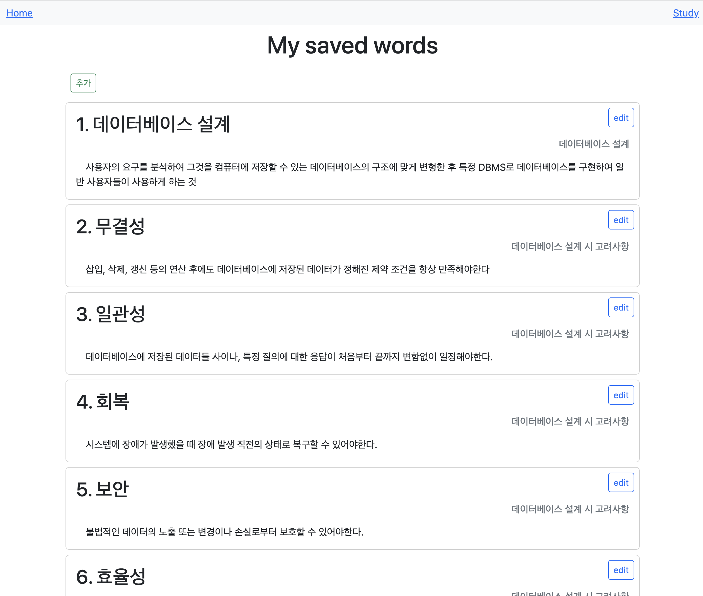
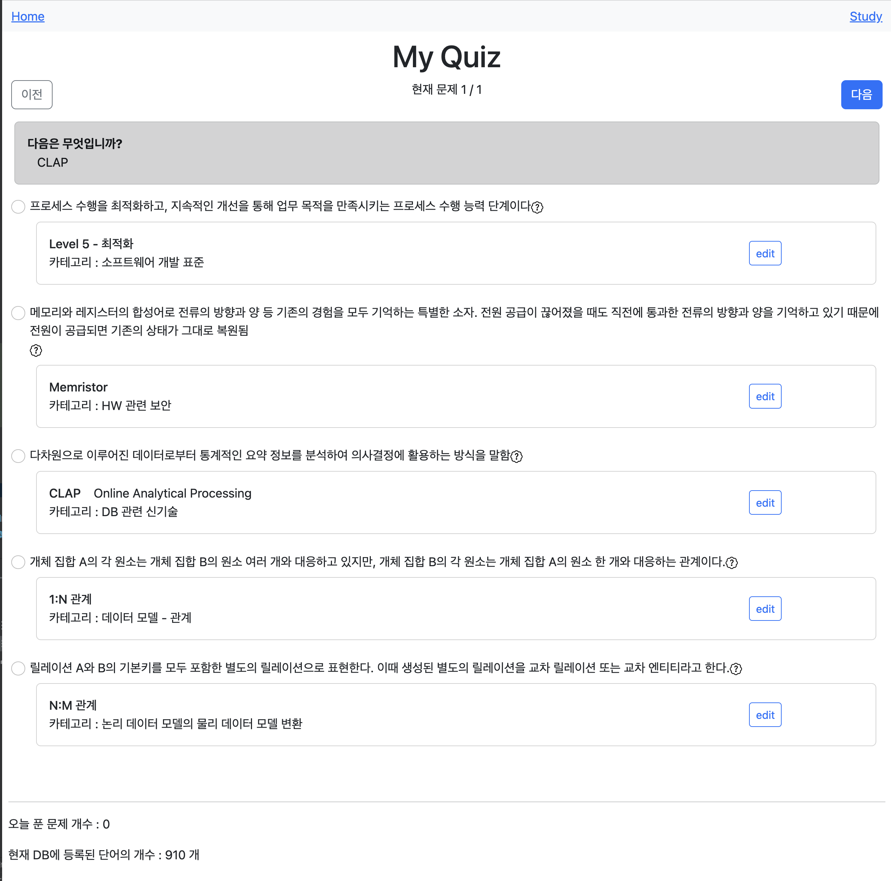

# My DB App 에 대해서

## 개요

서버 구성이 계속 변경하는 상황으로 엑셀에 공부한 것을 저장하면, csv Data를 Spring에서 읽고 PostreSQL 에 저장하고 API server 제공한다.
Vue 를 통해 프론트화면을 제공한다.

### 제작 목적

2023년 2월 정보처리기사 필기 시험을 앞두고 있는 관계로 공부 할겸, 프론트+백엔드 개인 프로젝트를 구상해보았다.

### 제작기간

2023년 1월 10일 ~ 1월 24일 (2주 간 진행)

### 구조

front service 를 구성할 [my-db-app] 폴더, back end service를 구성할 [myPrivateDB]로 프로젝트 폴더 구분한다.

### 사용한 기술 스택

- JAVA
  - Spring Boot
  - JPA
  - JUnit5
- Vue + BootStrap
- PostgreSQL
- Editor : (Front) VS Code (BackEnd) Intellij

#### 기술 스택 선정 이유

- Spring Boot : 웹 서비스를 공부하는 중, 확장성 넓게 WAS를 제공한다. 자료가 많아 예기치 않은 에러 상황을 해결하는데 큰 도움이 된다.
- JPA : JDBC 생으로 맵핑하는 건 생산성이 낮다. OOP 와 RDBS 의 가장 현실적 대안이라 생각하고 공부중이다.
- JUNIT5 : 프로젝트 시작 전에 왜 TDD가 필요한지 알게 되었다. Spring 진영에서 제일 많이 사용하고, BeforeEach나 SetUp 지원 같이 기능이 많아 익숙해지기 위해 채택했다.
- Vue + BootStrap : 원하는 기능 위해 JavaScript로만 구성하기엔 채산성이 낮았다. 그나마 제일 배우기 쉬웠던 Vue.js가 채택되었다.
- PostgreSQL : 처음엔 H2 DB에 공부한 것을 먼저 저장하고 update만 하려 했으나, 경험이 부족한 관계로 구조를 계속 바꿀 수 밖에 없었고 채산성이 낮았다. 기술에 의존하지 않기 위해 먼저 CSV를 활용했고 DB 상태에 대해 모니터링이 가능하며 무료인 RDBS로 이를 선택하게 되었다.

### 실현한 기술 목록

- CSV -> SQL server 등록
  
  
  
- REST API 를 제공한다
  
- Front Server에서 BackEnd Server 객체를 저장하고 불러올 수 있다.
  
- Modal 창에서 Word 를 CRUD 할 수 있다.
  
  
  
  
  
  
- Vue의 Router 기능을 활용했다.
  
- 랜덤 퀴즈를 자동으로 만들고 설명도 조회 가능하다.
  
  
- 키보드 입력을 받아들여 인터페이스를 확장했다. (vue:keyup 사용)
  

## 프로젝트 임시 중단 (1/26 ~)

프로젝트는 임시로 중단한다. 이유는 실질적으로 시험 기간이 가까워짐에 따라 정보처리기사 문제 풀이 및 알고리즘 복습
  (백준)
   (프로그래머스) 
  > 최대한 고민해서 풀어보고, 도저히 못풀겠다 싶을 때 해석 보고 다시 풀어봅니다... csv 변환하면서 왜 알고리즘 능력이 필요한지 확실히 알게 되었습니다.

### 추후 추가하고 싶은 부분

- Spring Security 로그인 기능 (할만하면 OAuth2도 새로 배워서..)
- 통계 기능(사용한다면 chart.js 예상)
- 카테고리별 조회기능(페이징도 추가)
- 단어 검색 기능(Qdsl 공부해서 적용하기)
- 영단어 섹터도 추가
- Swagger 사용?
- 웹 호스팅?

### 느낀점

- 도메인, 테이블을 무작정 늘리는게 능사가 아니란 걸 알았다. 구현만 복잡해지고 조회만 늘어났다. 왜 아키텍쳐가 중요한지 알게 되었다. 이런 시도를 많이 해봐야 좋은 아키텍쳐와 나쁜 아키텍쳐를 구분할 수 있을 것 같다.
- front 화면을 구성하는건 아직 어려웠다. JavaScript 변수형도 모르는 상태에서 React, Vue, Angular 고민부터 새로 기술을 습득하고, 적용시키기까지 시간을 꽤 오래 소요해버렸다.
- 기간이 길어지다보니 뭘 하던건지, 뭘 하려던건지 헷갈리기도 했다. "어디 주소에서 뭘 어떻게 하지?" 간단한 구조 계획도 없이 시작한 것도 독이었다. 점점 산으로 가고 있다는 걸 느꼈다. 그래서, 프로젝트 중간에 다시 계획을 세우느라 시간을 또 써버렸다.
- 그래도 잘한 점이라면, 그동안 만들어왔던 것들 중에 그나마 나은 외관과 기능을 가지면서 실용적이었던 것.

